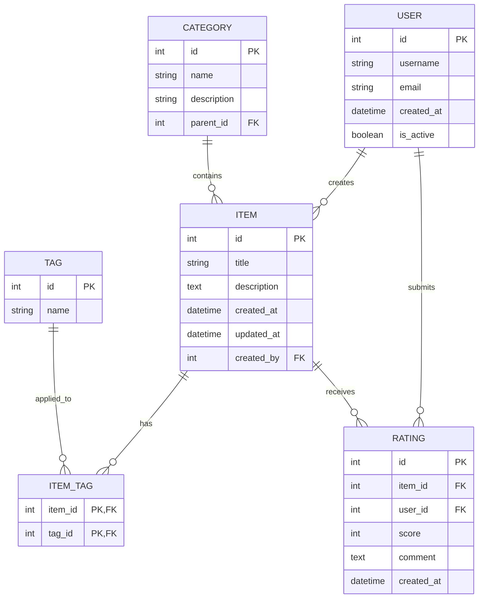

# Database Structure (Example)

*Note: This is a simplified, generic example of how a database diagram might be structured for a recipe application. It does not represent any actual production database schema.*

## Entity Relationship Diagram (Example)

## Key Entities

### User
Represents application users who can create content and interact with items.

### Category
Hierarchical classification system for organizing items.

### Item
The main content entity in the system (could represent recipes, articles, products, etc.).

### Tag
Flexible labeling system to help with item discovery and organization.

### Rating
User feedback and scoring system for items.

## Database Design Principles

When designing your own database schema, consider these principles:

1. **Normalize appropriately** - Balance normalization against query performance
2. **Use proper indexing** - Identify query patterns and index accordingly
3. **Consider data types carefully** - Choose appropriate types for space efficiency
4. **Plan for scale** - Design with future growth in mind
5. **Secure sensitive data** - Hash passwords, encrypt personal information

## Migration Strategy

For evolving your schema over time:
- Use versioned migrations
- Ensure backward compatibility when possible
- Create migration tests
- Document significant schema changes

*This generic example can be adapted to your specific application needs while maintaining appropriate abstraction for public documentation.*
