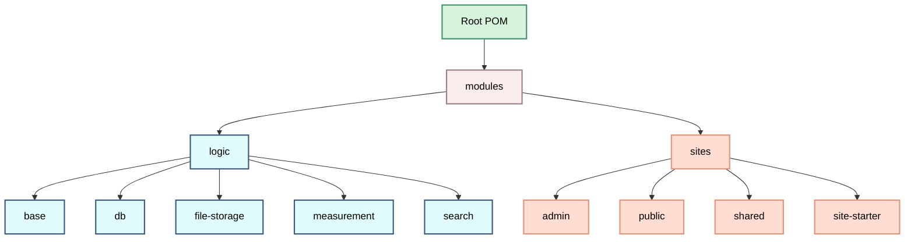

# Module Structure

## Overview
This project uses a modular architecture to separate concerns, promote code reuse, and facilitate AI-assisted development. The module structure is designed to clearly define boundaries between different parts of the system and establish explicit dependencies.

## Module Hierarchy

## Modules Module
This is an aggregator module that contains the modules `logic` and `site` 

### Logic Module
This is an aggregator module. The purpose is to contain modules for for example DB access, file storage and more. 

#### Logic/Base Module
Contains base functionality such as logging, environment configuration, and exception handling that is used across the application.

#### Logic/DB Module
Provides database access functionality, data access objects (DAOs), and table definitions for the application's data model.

#### Logic/File-Storage Module
Handles file storage operations, including storage and retrieval of files from a CDN.

#### Logic/Measurement Module
Manages measurement units, conversions, and quantity representations for recipe ingredients.

#### Logic/Search Module
Implements search functionality, including indexing, querying, text decomposition, and synonym handling.

## Sites Module
This is an aggregator module. The module contains modules for web interfaces and REST APIs for interacting with the system.
Currently there are two sites `Admin` and `Public`, but there could be only one or there code be more.

### Sites/Admin Module
This is sample code for an admin site

### Sites/Public Module
This is sample code for a public site

### Sites/Shared Module
- Common code used across the sites

### Sites/Site-Starter Module
- Determines which site to run based on configuration
- Initializes the appropriate site
- Handles startup and shutdown procedures
- Configures server parameters

